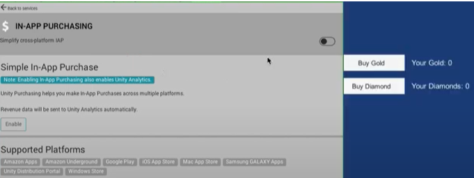
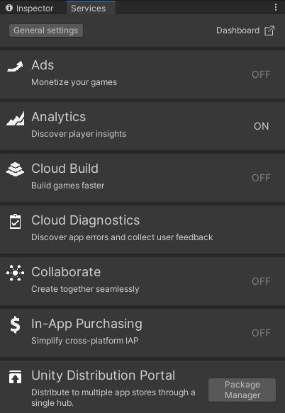
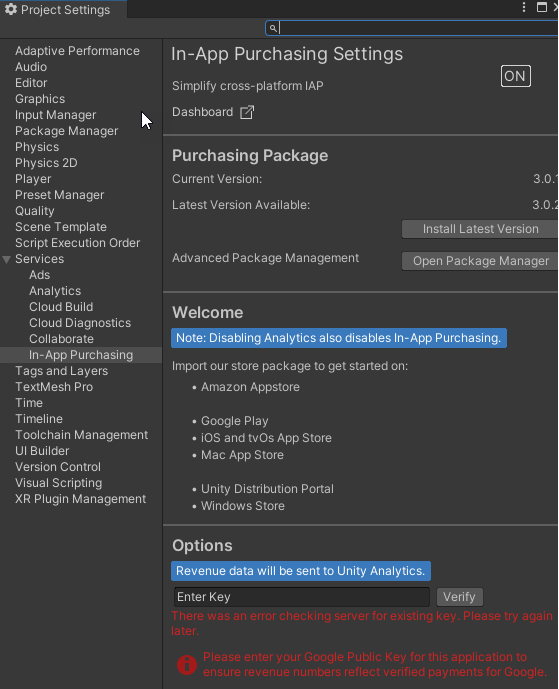
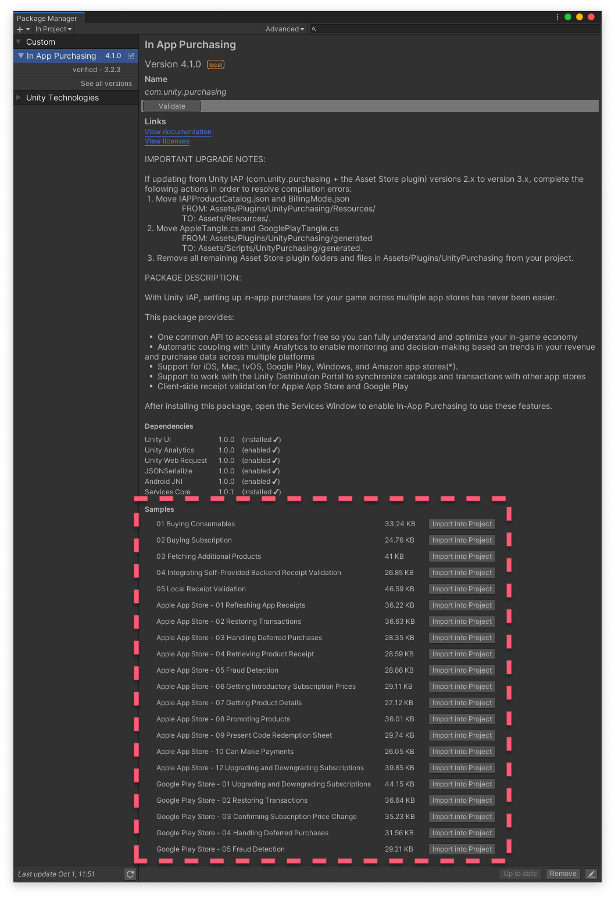

# Setting up Unity IAP

**Note**: Screenshots and menu choices may differ between release versions.

## Overview

This document explains how to activate **In-App Purchasing** (IAP).  

The Unity IAP package provides coded and codeless approaches that you set up to:
- Allow users to buy items in your games.
- Connect to stores so you can obtain revenue from these purchases.

Here is an overview of the steps to get IAP working in your project:

- Define your in-app purchase strategy for this game.
- Set up your project to use Unity Services.
- Activate IAP to automatically install the package.
- Configure settings.
- Create and catalog your in-game items that you want to sell.
- Use the Codeless IAP button to give users a way to buy items. Then, once you have the logic working, consider customizing the button look and feel or use the scripted IAP for a rich API to enhance this process. 
- Connect your app to your chosen app stores, such as Google or Apple.  
- Add items to the stores.

You can also do many of these steps or finetune what you create with the [In-App Purchasing API](https://docs.unity3d.com/Packages/com.unity.purchasing@latest/api/index.html).

Put it all together:

- Configure your in-app purchases using guidance from this doc, support, and the IAP forum.
- Test your stores, items, and purchase flows.
- Make your stores and in-app purchases live after successful testing.

## Getting Started

**Note**: The Samsung Galaxy store is now obsolete and is no longer supported in the Unity In-App Purchasing package 4.0.0 and higher. This guide to configure the Samsung Galaxy store only applies to the IAP package version 3.1.0 and earlier. If you’re using the Unity IAP package 4.0.0 and higher and want to implement a Samsung Galaxy store, use the [Unity Distribution Platform](https://docs.unity3d.com/Manual/udp.html) instead.

1. Open your Unity project in the Unity Editor.
2. From the menu, go to **Window** > **General** > **Services** to open the **Services** window.
3. Create a Project ID, then connect the project to an organization.
4. Answer the COPPA compliance questions.
5. The **Services** window displays a list of services. Click **In-App Purchasing**.

6. The **Project Settings** window opens.

7. Click the toggle next to **In-App Purchasing Settings** to **ON**.

This will automatically install the IAP package from the Package Manager, providing you with new features and menu items to help you manage IAP.  

## Next Steps

### Define your In-App Purchase strategy

Your task will be to create items for players to buy and obtain their identifiers.

To make this happen behind the scenes, you must tie product identifiers (strings) to each item you are selling using a specified format. Some stores require that you customize the **Product ID** for their stores.

#### Planning:

Before you create your products, consider how you will define the following in your stores:

- Your strategy to determin when and how users can buy items.
- Your pricing strategy.
- The types of products (subscriber, consumable, non consumable).

## Learn more

#### IAP Samples

1. From the **IAP Project Settings Page**, click **Open Package Manager** from **Options**.
2. Navigate to **In App Purchasing**. On the right information panel, find **Samples**.
3. Expand **Samples**, then click **Import**.

#### Forum tutorials

[See the Unity forum](https://forum.unity.com/threads/sample-iap-project.529555/). 

#### Unity Learn IAP classes

[Refer to the Unity Learn IAP classes](https://learn.unity.com/tutorial/unity-iap) for more guidance. 

## Troubleshooting

#### How to resolve compilation errors during upgrades

**Important notes if you are upgrading from Unity IAP version 2.x to future versions.**

If updating from Unity IAP (com.unity.purchasing + the Asset Store plugin) versions 2.x to future versions, complete the following actions in order to resolve compilation errors:

- Move `IAPProductCatalog.json` and `BillingMode.json`from `Assets/Plugins/UnityPurchasing/Resources/`   to ` Assets/Resources/`
- Move `AppleTangle.cs` and `GooglePlayTangle.cs`  FROM: 'Assets/Plugins/UnityPurchasing/generated'  TO: `Assets/Scripts/UnityPurchasing/generated`.
- Remove all remaining Asset Store plugin folders and files in `Assets/Plugins/UnityPurchasing` from your
project.

#### Common Unity IAP integration compiler errors
The following error messages may indicate that Unity IAP is disabled in the Unity Cloud Services window, or that Unity is disconnected from the Internet:
* `CS0246`
* `System.Reflection.ReflectionTypeLoadException`
* `UnityPurchasing/Bin/Stores.dll`
* `UnityEngine.Purchasing`

To resolve these errors:

Reload the Services window by closing, then reopening it. Once reloaded, ensure that the Unity IAP service is enabled.
If this doesn’t work, try disconnecting and reconnecting to the Internet, then sign back into Unity Services and re-enable Unity IAP.

**Note**: You must have an **Owner** or **Manager** role for the project.
